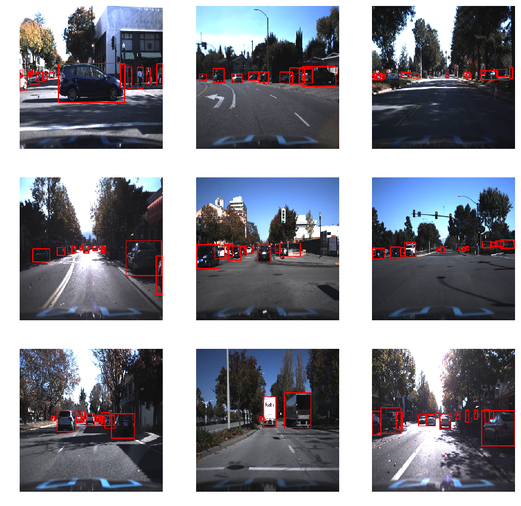
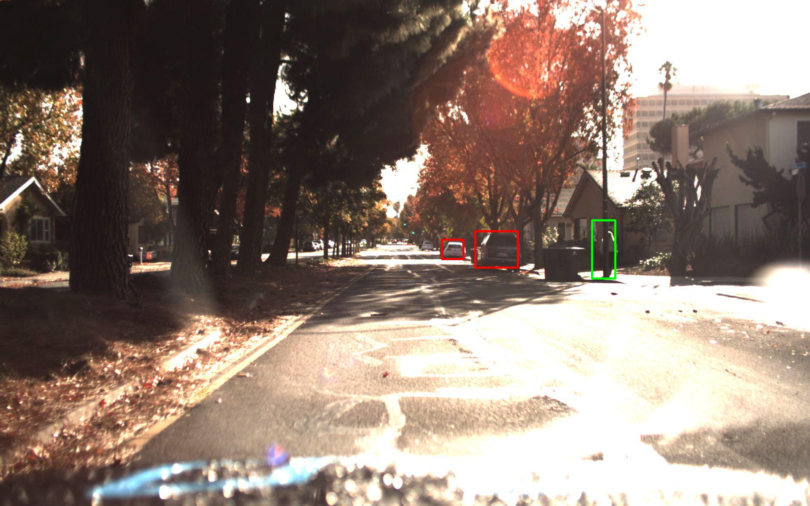
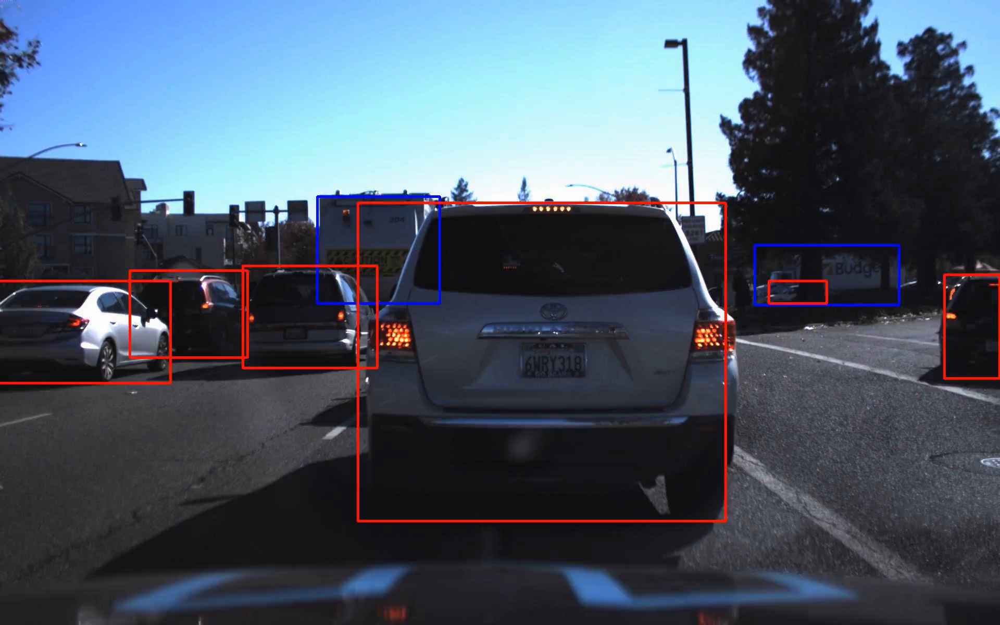

# Object/Traffic detection with YOLO v2
YOLO v2 Tensorflow implementation from scratch

I implemented the [YOLO v2 paper](https://arxiv.org/abs/1612.08242) and trained it from scratch 
with tensorflow. For training I used [Udacity's public datasets](https://github.com/udacity/self-driving-car/tree/master/annotations)

Videos with predictions can found here:
[Predictions on dataset1](https://www.youtube.com/watch?v=rvcDNt6Nio8&t=3s)
[Predictions on dataset2](https://www.youtube.com/watch?v=l-Wrobbmju8&t=16s)

